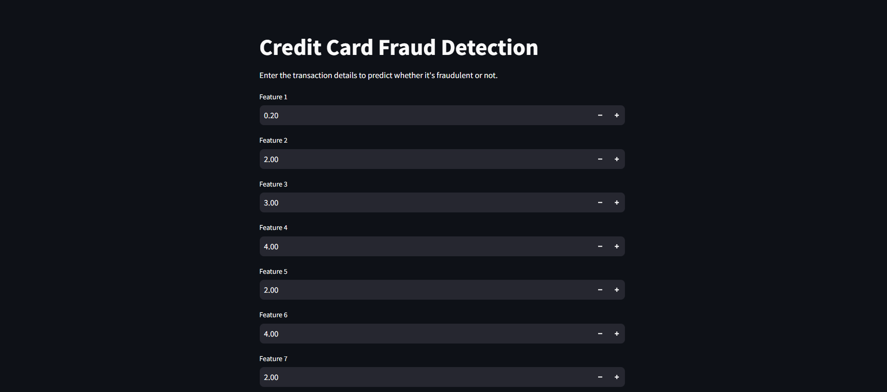

# Credit Card Fraud Detection

## Project Overview

### 1. Project Title
**Credit Card Fraud Detection**

### 2. Project Focus
The project aims to identify fraudulent transactions using machine learning techniques, providing a robust solution for real-time fraud detection.

### GitHub Repository
[Credit Card Fraud Detection GitHub Repository](https://github.com/Eswar021/Credit-Card-Fraud-Detection)

---

## Project Demo Images




---

## 1. Data Collection and Preprocessing

### Data Collection
- **Sources**: The main dataset was sourced from the Kaggle Credit Card Fraud Detection dataset, containing credit card transactions from September 2013.
- **Dataset Link**: [Kaggle Credit Card Fraud Detection Dataset](https://www.kaggle.com/datasets/mlg-ulb/creditcardfraud)
- **Types of Data**: Features include transaction amounts, transaction times, PCA-transformed features, and a binary label indicating whether a transaction is fraudulent.
- **Formats**: Data was provided in CSV format, then processed for analysis.

### Data Preprocessing
- **Cleaning**: Removed duplicate records and handled missing values.
- **Normalization**: Standardized the 'Amount' feature to ensure consistency in the model.
- **Feature Engineering**: Applied oversampling techniques like SMOTE to balance the dataset and improve model performance in detecting fraudulent transactions.
- **Splitting**: The dataset was divided into training and testing sets for effective model evaluation.

---

## 2. Model Training Architecture

### Model Selection
- **Algorithms Used**: Implemented various classifiers including Logistic Regression, Decision Tree Classifier, Gaussian Naive Bayes, and Random Forest Classifier.
  
### Training Process
- **Training Set**: Models were trained on the transaction dataset with hyperparameter tuning to enhance performance.
- **Validation**: Cross-validation was utilized to prevent overfitting and ensure the models were generalizable.

### Model Performance
- **Accuracy**: Achieved an average accuracy of over 95% across different models.
- **Evaluation Metrics**: Used metrics such as accuracy, F1 score, precision, and recall to evaluate model effectiveness.

---

## 3. User Interface and Interaction

### UI Design
- **Forms**: Designed an intuitive web interface using Streamlit, allowing users to input transaction details.
- **Display**: Clearly presents results, showing whether a transaction is likely to be fraudulent.

### Features
- **Interactive Forms**: Users can input transaction details to receive real-time fraud predictions.
- **Results Presentation**: Displays prediction outcomes with confidence levels, enhancing user understanding.

---

## 4. Deployment

### Deployment Strategy
- **Platform**: Deployed using Docker containers for environment consistency.
- **Hosting**: Hosted on AWS for scalability and reliability.
- **Maintenance**: Regular updates and monitoring ensure application performance and accuracy.

### Security Measures
- **Data Protection**: Secure handling of user data with encryption and safe storage practices.
- **Access Control**: User authentication restricts access to sensitive features and maintains data integrity.

---

## 5. Novelty and Innovation

### Existing Methodologies
- **Traditional Approaches**: Conventional fraud detection models often rely on basic thresholds or rules-based systems.
- **Limitations**: These methods may struggle to identify complex fraud patterns accurately.

### Innovations in Credit Card Fraud Detection
- **Advanced Techniques**: Leveraged ensemble learning methods and oversampling techniques to enhance fraud detection rates.
- **High Accuracy**: Achieved high precision and low false positive rates, significantly improving performance.
- **User-Centric Design**: Developed an accessible interface that streamlines fraud detection for end-users, aiding decision-making.

---

## Installation and Running Instructions

1. Clone the repository:

    ```bash
    git clone https://github.com/Eswar021/Credit-Card-Fraud-Detection.git
    cd Credit-Card-Fraud-Detection
    ```

2. Install required dependencies:

    ```bash
    pip install -r requirements.txt
    ```

3. Run the Streamlit app:

    ```bash
    streamlit run app.py
    ```
---